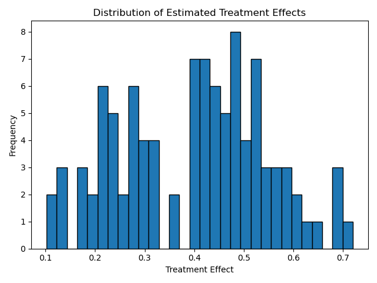
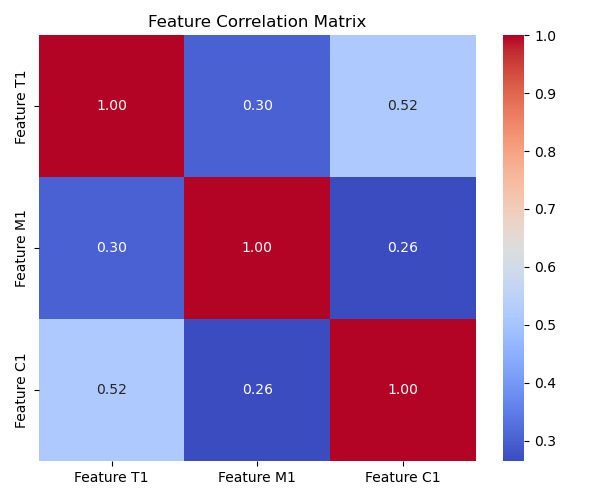
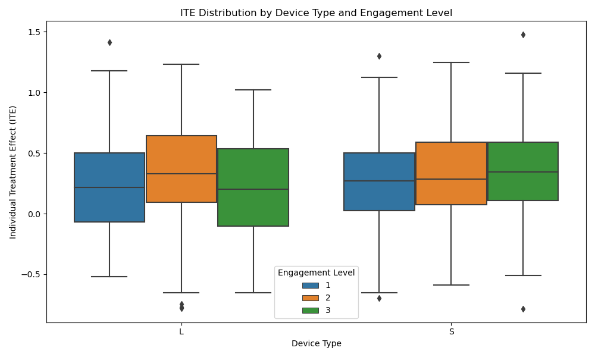
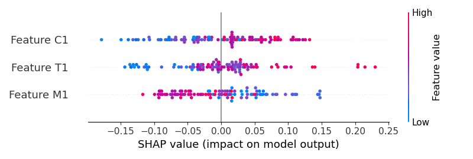
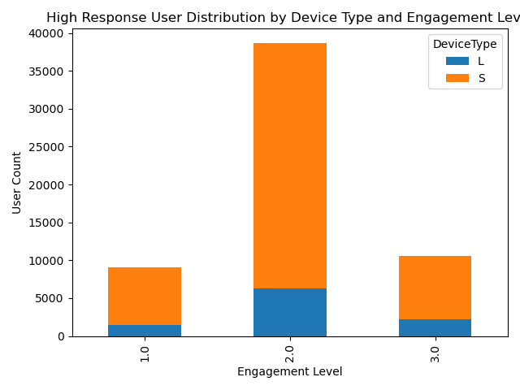
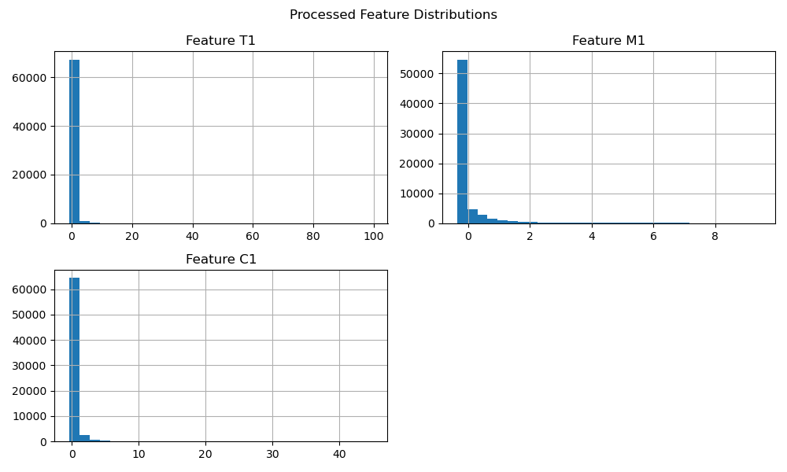

# Causal_Forests
# 🌲 Causal Forests: Estimating Individual Treatment Effects

Causal Forests are a machine learning algorithm designed for estimating **Individual Treatment Effects (ITE)** from observational or experimental data. They extend the concept of traditional random forests to address causal inference challenges, especially where **treatment effect heterogeneity** is of interest.

---

## 🧠 Core Concepts

### 🎯 Individual Treatment Effect (ITE)

- ITE represents the difference in outcomes for an individual if they **receive** versus **do not receive** a treatment.
- Formally, it is defined as:

  \[
  \tau(x) = \mathbb{E}[Y(1) - Y(0) \mid X = x]
  \]

  Where:
  - \( Y(1) \): Outcome if treated  
  - \( Y(0) \): Outcome if not treated  
  - \( X \): Covariate vector describing the individual

---

### 🌐 Treatment Effect Heterogeneity

- Causal Forests go beyond estimating **Average Treatment Effects (ATE)** by modeling how effects **vary with covariates \( X \)**.
- This enables **personalized causal inference**, revealing which types of individuals benefit more (or less) from treatment.

---

### 🪓 Splitting Criterion

- Unlike classical decision trees that minimize prediction error, causal forests use **splitting rules** that maximize **treatment effect heterogeneity**.
- The idea is to recursively partition the feature space to isolate **subpopulations** with distinct causal responses.

---

## ⚙️ Algorithm Workflow

### 1. Data Preparation

Input dataset should include:
- **Features (X)**: Covariates or input variables
- **Treatment (W)**: Binary indicator (1 = treated, 0 = control)
- **Outcome (Y)**: Observed outcome or response variable

---

### 2. Tree Construction via Random Sampling

- Draw bootstrap samples from the data.
- For each sample, build a **causal decision tree** by recursively splitting based on a treatment effect heterogeneity criterion.

---

### 3. Node Splitting

- Nodes are split by maximizing the **variance in treatment effects** across child nodes.
- Recursive partitioning continues until a **minimum node size** or other stopping criteria is met.

---

### 4. Leaf-Level Estimation

- In each leaf, estimate the **local treatment effect** \( \tau(x) \).
- Estimation may involve:
  - **Propensity score adjustment**
  - **Double machine learning**
  - Or other statistical methods to correct for confounding

---

### 5. Forest Aggregation

- Combine multiple causal trees into a **causal forest**.
- The final ITE for each individual is the **average** of their predictions across all trees.

---
### Ouput examples

## 📊 Advantages of Causal Forests

- Handles **non-linear interactions** between features
- Captures **heterogeneous treatment effects**
- Allows for **individual-level inference**
- Compatible with **observational** and **experimental** data

---

## 🔬 Applications

- Personalized medicine  
- Economic and policy evaluation  
- Marketing and A/B testing  
- Precision agriculture  
- Any domain where **"what works for whom"** matters

---

> **Note:** Causal forests are implemented in libraries like `grf` (R), `econml` (Python), and can be extended with frameworks like `DoubleML`.

